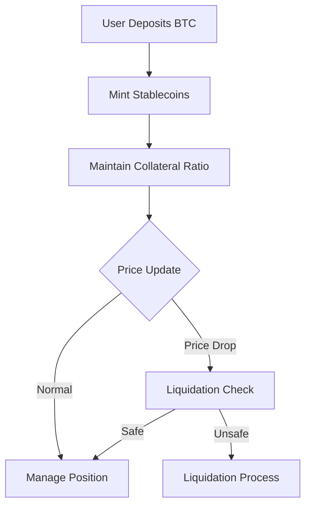

# StableBTC Protocol

## Overview

StableBTC is a decentralized lending protocol enabling Bitcoin holders to mint stablecoins while maintaining over-collateralized debt positions (CDPs). This system combines Bitcoin's store-of-value properties with DeFi functionality, allowing BTC holders to access liquidity without selling their assets.

## Key Features

- **BTC-Backed Stablecoins**: Mint stablecoins against Bitcoin collateral
- **Over-Collateralization**: Minimum 150% collateral ratio for positions
- **Auto-Liquidation**: Positions below 120% collateralization get liquidated
- **Dynamic Interest Rates**: 0.0005% per block interest (~10% APR)
- **Real-Time Risk Management**: Continuous collateral health monitoring
- **Decentralized Governance**: Protocol parameter control by DAO

## System Architecture

### Core Components

1. **Collateral Vault**
   - Stores user-deposited BTC (wrapped)
   - Tracks collateral/debt ratios
   - Implements 150% minimum collateralization

2. **Debt Engine**
   - Manages stablecoin minting/burning
   - Calculates accrued interest
   - Maintains global debt ledger

3. **Liquidation Module**
   - Monitors positions in real-time
   - Triggers auctions for undercollateralized positions
   - Applies 10% liquidation penalty

4. **Price Oracle**
   - BTC/USD price feed integration
   - 24-hour price freshness requirement
   - Decentralized data sourcing

5. **Stability Reserve**
   - Collects liquidation penalties
   - Maintains protocol solvency
   - Processes stability fees

### Workflow



## Usage Guide

### Key Transactions

1. **Create Position**

   `(create-position btc-amount stable-amount)`
   - Minimum loan: 100 stablecoins
   - Initial collateral ratio ≥150%

2. **Manage Collateral**  

   ```clarity
   (add-collateral 500000)  // Add 0.005 BTC
   (withdraw-collateral 200000)  // Remove 0.002 BTC
   ```

3. **Debt Management**  

   ```clarity
   (repay-debt 50000000)  // Repay 50 stablecoins
   ```

4. **Liquidation**  

   `(liquidate-position user-address)`

### Example Position

```clarity
BTC Collateral: 0.1 BTC ($4,000)
Minted Stablecoins: 2,000 USD
Collateral Ratio: 200%
Liquidation Threshold: $2,400 (120% of debt)
```

## Protocol Parameters

| Parameter | Value | Description |
|-----------|-------|-------------|
| Minimum Collateral Ratio | 150% | Minimum collateralization requirement |
| Liquidation Threshold | 120% | Collateral level triggering liquidation |
| Liquidation Penalty | 10% | Fee applied during liquidations |
| Interest Rate | 0.0005%/block | ~10% APR at 2-minute blocks |
| Price Feed Expiry | 24h | Maximum allowed price data age |

## Security Features

- **Battle-Tested Clarity Language**: Predictable smart contract execution
- **Time-Locked Governance**: Critical parameter changes require 72h delay
- **Circuit Breaker**: Protocol pausing mechanism for emergencies
- **Multi-Sig Oracle**: Decentralized price feed management

## Error Codes

| Code | Error | Description |
|------|-------|-------------|
| 1000 | Unauthorized | Caller lacks required permissions |
| 1001 | Insufficient Collateral | Below minimum collateral requirement |
| 1003 | Undercollateralized | Post-withdrawal ratio violation |
| 1006 | Stale Price | Oracle data older than 24h |
| 1007 | Protocol Paused | Emergency shutdown active |

## Governance

Protocol parameters controlled through:

1. Time-locked governance proposals
2. STBTC governance token voting
3. Emergency multisig (3/5) for critical issues
